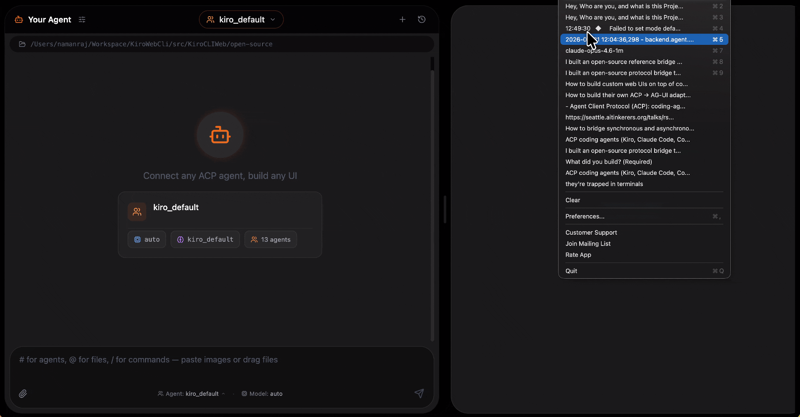
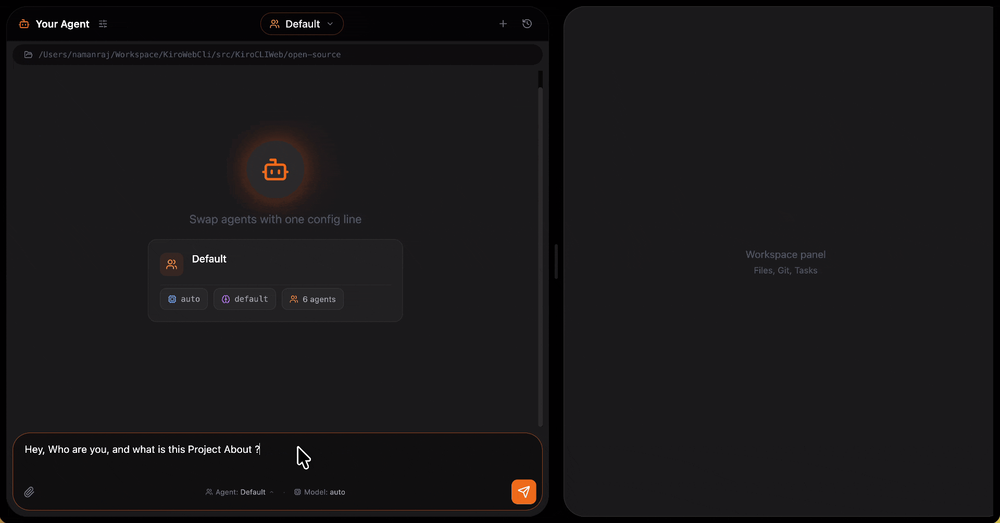
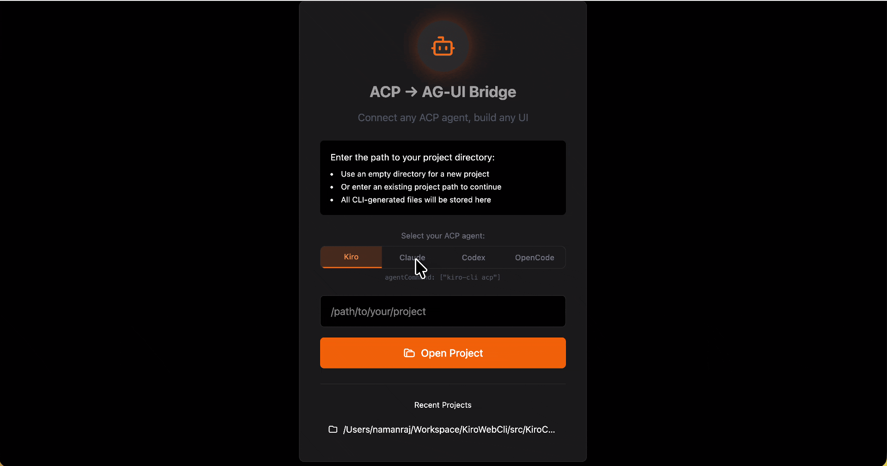
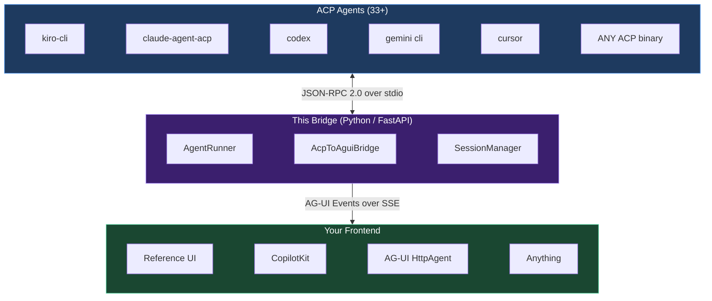
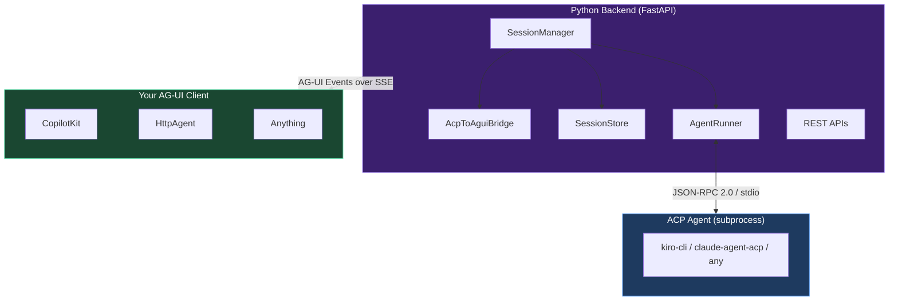

<h1 align="center"><a href="https://agentclientprotocol.com">ACP</a> → <a href="https://docs.ag-ui.com">AG-UI</a></h1>
<p align="center">
  <a href="https://agentclientprotocol.com">agentclientprotocol.com</a> &nbsp;→&nbsp; <a href="https://docs.ag-ui.com">docs.ag-ui.com</a>
</p>

<p align="center">
  A reference bridge that gives any ACP coding agent (Kiro, Claude, Codex, etc.) a web UI via the AG-UI protocol.
</p>

<p align="center">
  <a href="https://opensource.org/licenses/MIT"></a>
  <a href="https://www.python.org/downloads/"></a>
  <a href="https://pypi.org/project/agent-client-protocol/"></a>
  <a href="https://docs.ag-ui.com"></a>
  <a href="https://fastapi.tiangolo.com"></a>
</p>

<p align="center">
  
  
</p>
<p align="center">
  <em>Left: Kiro CLI powering the workspace. Right: same UI with Claude Code. Just swap the agent.</em>
</p>

<p align="center">
  
</p>
<p align="center">
  <em>Select your agent from the frontend. No restart needed. Each session spawns the chosen binary.</em>
</p>

---

## The Problem

There are now **33+ coding agents** that support the [Agent Client Protocol (ACP)](https://agentclientprotocol.com): Kiro, Claude Code, Codex CLI, Cursor, Gemini CLI, GitHub Copilot, OpenCode, Cline, and many more. They all speak JSON-RPC 2.0 over stdio. You can use them in terminals. You can use them in editors.

But teams keep needing **purpose-built web interfaces** on top of these agents: a micro-app creation platform where non-engineers iterate on device experiences, a report generation UI where analysts interact with agents without learning CLI commands, deployment dashboards with team-visible approval flows, domain-specific editors powered by an agent underneath.

Today, building any of these means implementing the protocol bridge yourself: parsing JSON-RPC streams, managing subprocesses, translating events into something a web frontend can render.

## The Solution

This project is a **reference bridge** that sits between any ACP agent and any web frontend:



Clone this repo, select your agent, and you have a working web UI with streaming chat, tool visualization, and human-in-the-loop approvals.

## Use Cases

Same agent underneath. Different frontend for each audience:

- **Micro-app creation platforms**: non-engineers iterating on apps through a web workspace
- **Report generation**: analysts interacting with agents without CLI commands
- **Deployment dashboards**: team-visible approval flows for infrastructure changes
- **Domain-specific IDEs**: focused editors (config, pipelines) powered by an agent
- **Any internal tooling**: the agent does the heavy lifting, users get a tailored UI

## Why AG-UI?

[AG-UI](https://docs.ag-ui.com) (Agent-User Interaction Protocol) is the open standard for connecting AI agents to frontends. Instead of rolling your own SSE/WebSocket protocol, you get:

- **~16 standard event types**: streaming chat, tool calls, state sync, generative UI, interrupts
- **Transport agnostic**: works over SSE, WebSockets, or webhooks
- **Rich ecosystem**: supported by CopilotKit, LangGraph, Google ADK, AWS Strands, Pydantic AI, and 20+ frameworks
- **Frontend SDKs**: TypeScript, Python, Kotlin, Go, Rust, and more
- **Human-in-the-loop built in**: pause, approve, reject, or redirect agent execution mid-flow

By emitting AG-UI events, your frontend becomes portable across the entire agent ecosystem. See [`docs/why-agui.md`](docs/why-agui.md) for a deep dive on what this unlocks: CopilotKit integration, shared state, generative UI, and more.

## Quick Start

Works on macOS, Linux, and Windows (PowerShell or cmd). Prereqs: Python 3.11+, Node.js 18+, pnpm.

```bash
git clone https://github.com/namanrajpal/acp-to-agui.git
cd acp-to-agui
pnpm install
pnpm dev:backend
```

The bridge runs on **http://localhost:9001**. Any AG-UI client (CopilotKit, `@ag-ui/client` HttpAgent, or your own) can POST to `http://localhost:9001/ag-ui` and receive an SSE stream of AG-UI events. Connect your own frontend, or use the AG-UI SDK to build one.

<details>
<summary>Platform notes</summary>

- **macOS / Linux**: `pnpm dev:backend` runs uvicorn with `--reload`, so Python edits hot-reload automatically.
- **Windows**: `--reload` is skipped automatically because uvicorn's reload supervisor installs an asyncio event loop policy that can't spawn subprocesses (you'd hit `NotImplementedError` from `_make_subprocess_transport` the moment you tried to start a session). Restart `pnpm dev:backend` manually after backend edits.
- **Windows + non-`.exe` agents** (`npx`, `claude-agent-acp`, etc.): the bridge auto-wraps `.cmd`/`.bat` shims with `cmd.exe /c` so you can use the same `agentCommand` config as on Unix. Native `.exe` agents like `kiro-cli` pass through unchanged.

</details>

## Configuration

The config file sets the default agent:

```json
{
  "projectName": "acp-to-agui",
  "displayTitle": "ACP → AG-UI Bridge",
  "agentCommand": ["opencode", "acp"],
  "backendPort": 9001,
  "corsOrigins": ["http://localhost:3000", "http://localhost:3001"]
}
```

### Supported agents

| Agent | Command | Auth |
|-------|---------|------|
| Kiro CLI | `["kiro-cli", "acp"]` | AWS Builder ID |
| Claude Agent | `["claude-agent-acp"]` | `ANTHROPIC_API_KEY` |
| Codex CLI | `["codex-acp"]` | ChatGPT subscription or API key |
| OpenCode | `["opencode", "acp"]` | OpenCode Zen or provider API key |
| Gemini CLI | `["gemini", "cli", "acp"]` | Google auth |
| Cursor | `["cursor", "--acp"]` | Cursor subscription |
| GitHub Copilot | `["github-copilot-cli", "--acp"]` | GitHub auth |
| Goose | `["goose", "--acp"]` | Provider API key |
| Any ACP binary | `["your-agent", "acp"]` | Varies |

### API-level control

You can also pass `agentCommand` directly when creating a session via REST:

```bash
curl -X POST http://localhost:8000/v2/tasks \
  -H "Content-Type: application/json" \
  -d '{"cwd": "/your/project", "agentCommand": ["claude-agent-acp"]}'
```

## Architecture



## Protocol Translation

| ACP Event | AG-UI Event(s) | Notes |
|-----------|---------------|-------|
| `agent_message_chunk` | `TEXT_MESSAGE_START` + `TEXT_MESSAGE_CONTENT` | Opens message on first chunk |
| `tool_call` | `TOOL_CALL_START` + `TOOL_CALL_ARGS` | Closes open text message first |
| `tool_call_update` | `TOOL_CALL_ARGS` or `TOOL_CALL_END` | Based on status field |
| `turn_end` | `TEXT_MESSAGE_END` + `TOOL_CALL_END`(s) + `RUN_FINISHED` | Closes everything |
| `session/request_permission` | `RUN_FINISHED{outcome:interrupt}` | Parks the prompt task; resumed via a new run with `resume` entries |
| Vendor extensions (`_*.dev/*`) | `CUSTOM` events | Normalized to `agent:*` namespace |

See [`docs/protocol-translation.md`](docs/protocol-translation.md) for the full mapping with diagrams.

## The Tricky Parts

ACP and AG-UI do not map one-to-one. These required a normalization layer:

**Tool Approvals:** ACP's SDK calls `request_permission()` and blocks waiting for a return value. AG-UI's standard HITL works the opposite way: the run *ends* with `RUN_FINISHED{outcome:interrupt}` and the client resumes with a new run carrying `resume` entries. The bridge parks the prompt task at an `asyncio.Future`, emits the interrupt, and resolves the Future when the resume run arrives — one logical ACP turn maps to N+1 AG-UI runs.

**Message Boundaries:** ACP streams `agent_message_chunk` continuously. AG-UI needs explicit `TEXT_MESSAGE_START` and `TEXT_MESSAGE_END` events. The bridge tracks open message state and auto-closes before tool calls or turn end.

**Vendor Extensions:** ACP agents send custom notifications (e.g., `_kiro.dev/mcp_servers_ready`). The SDK routes these to `ext_notification()`. We normalize them into `CUSTOM` AG-UI events with a clean `agent:*` namespace.

## How It Works

1. **Select an agent** via the `agentCommand` API field or the `bridge.config.json` default
2. **Create a session**: `POST /v2/tasks` spawns the agent subprocess, initializes ACP
3. **Start a run**: `POST /v2/tasks/{id}/run` sends your prompt via JSON-RPC
4. **Stream events**: `GET /v2/tasks/{id}/events?runId=...` returns AG-UI SSE stream
5. **Or use the standard endpoint**: `POST /ag-ui` (what CopilotKit and AG-UI HttpAgent use)
6. **Handle approvals**: the run ends with `RUN_FINISHED{outcome:interrupt}`; resume with a new run carrying `resume: [{interruptId, status, payload}]`

<details>
<summary>Project Structure</summary>

```
├── agui_on_acp/                # Python FastAPI bridge (the package)
│   ├── agent/                  # ACP SDK integration (spawn + protocol)
│   ├── bridge/                 # ACP → AG-UI event translation
│   ├── agui/                   # AG-UI event types + SSE encoding
│   ├── sessions/               # Session lifecycle, store, routes
│   └── agui_endpoint.py        # POST /ag-ui (AG-UI standard endpoint)
├── pyproject.toml              # Python package + entry point
├── docs/
│   ├── architecture.md         # Detailed system design
│   ├── integration-contract.md # REST + SSE API spec
│   ├── protocol-translation.md # Full ACP ↔ AG-UI mapping
│   └── why-agui.md            # AG-UI ecosystem benefits
├── bridge.config.json          # Your agent configuration
└── package.json                # Backend dev launcher
```

</details>

## Tested With Real Agents

| Agent | Version | Status | Notes |
|-------|---------|--------|-------|
| **Kiro CLI** | 2.3.0 | ✅ Working | 13 modes, extension notifications, full streaming |
| **Claude Agent** (claude-agent-acp) | 0.36.1 | ✅ Working | 5 modes, prompt queueing, embedded context |
| **Codex CLI** (codex-acp) | 0.14.0 | 🟡 Supported | Via Zed adapter, tool calls + edit review |
| **OpenCode** | 1.15.6 | 🟡 Supported | Native ACP, 2 agents (build/plan), MCP servers |

Kiro and Claude Agent tested end-to-end with zero code changes between them. Codex and OpenCode are ACP-compatible and supported by this bridge; community testing welcome. Just swap `agentCommand`. See [`docs/demo-walkthrough.md`](docs/demo-walkthrough.md) for full test results.

<details>
<summary>Full ACP Ecosystem (33+ agents)</summary>

| Agent | ACP Type | Notes |
|-------|----------|-------|
| Kiro CLI | Native | Full-featured, 13+ modes, custom agents |
| Claude Code | Via adapter ([claude-agent-acp](https://github.com/zed-industries/claude-code-acp)) | Permission modes, tool calls, MCP |
| Codex CLI | Via adapter ([codex-acp](https://github.com/zed-industries/codex-acp)) | Edit review, slash commands, MCP |
| OpenCode | Native | 2 built-in agents, custom tools, MCP |
| Gemini CLI | Native | Google's coding agent |
| GitHub Copilot | Native (public preview) | Copilot in terminal |
| Cursor | Native | IDE agent over ACP |
| Goose | Native | Block's open-source agent |
| Cline | Native | VS Code agent with ACP |

Also supported: Augment Code, AutoDev, Blackbox AI, Docker cagent, fast-agent, Factory Droid, Hermes Agent, Junie (JetBrains), Kimi CLI, Mistral Vibe, OpenHands, Poolside, Qwen Code, and more.

Full list: [agentclientprotocol.com/get-started/agents](https://agentclientprotocol.com/get-started/agents)

</details>

## The Talk

This repository accompanies a live demo presented at [Seattle AI Tinkerers](https://seattle.aitinkerers.org/), May 2026.

## Contributing

Contributions welcome! Areas of interest:

- Additional agent configuration examples
- Session resume/persistence improvements
- More AG-UI event types (STATE_DELTA, activities, reasoning)
- Interrupt/resume edge case handling

## License

MIT

---

<sub>This project is independent and is not affiliated with, endorsed by, or sponsored by Amazon/Kiro, Anthropic/Claude, OpenAI/Codex, Google/Gemini, GitHub/Copilot, Cursor/Anysphere, OpenCode, Cline, or their respective owners. All product names, logos, and trademarks are property of their respective owners.</sub>
