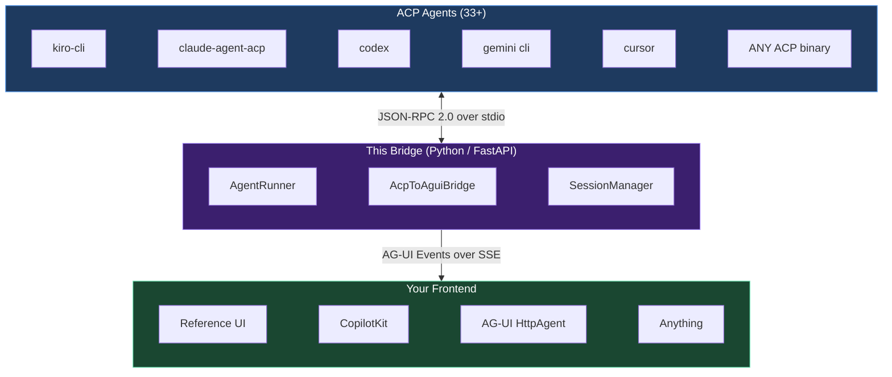
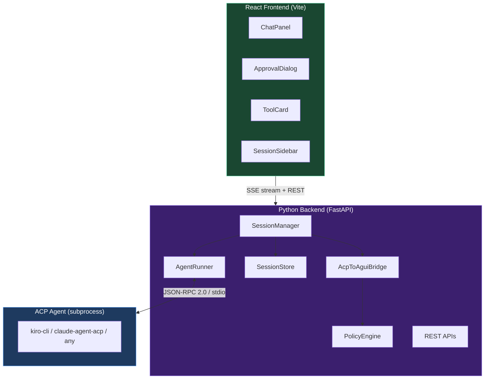
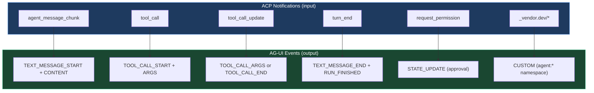
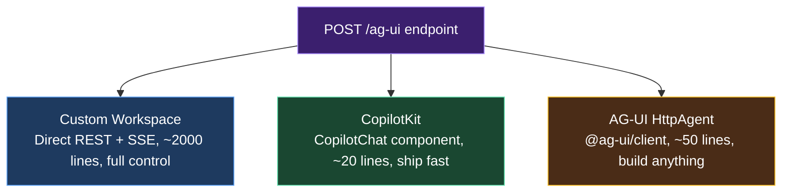

# ACP → AG-UI

[](https://opensource.org/licenses/MIT)
[](https://www.python.org/downloads/)
[](https://pypi.org/project/agent-client-protocol/)
[](https://docs.ag-ui.com)
[](https://fastapi.tiangolo.com)

> Coding agents live in terminals. This adapter gives them rich web UIs.

<p align="center">
  
</p>
<p align="center">
  <em>An ACP coding agent (kiro-cli) powering a web chat UI via AG-UI events. Zero custom protocol code.</em>
</p>

<details>
<summary>See the raw AG-UI events flowing over SSE</summary>
<p align="center">
  
</p>
</details>

---

## The Problem

There are now **33+ coding agents** that support the [Agent Client Protocol (ACP)](https://agentclientprotocol.com): Kiro, Claude Code, Codex CLI, Cursor, Gemini CLI, GitHub Copilot, OpenCode, Cline, and many more. They all speak JSON-RPC 2.0 over stdio. You can use them in terminals. You can use them in editors.

But what if you want a **custom web workspace**? A task board for your team? A domain-specific IDE? A deployment dashboard powered by an AI agent? You'd need to implement the protocol bridge yourself: parsing JSON-RPC streams, managing subprocesses, translating events into something a web frontend can render.

## The Solution

This project is a **protocol bridge** that sits between any ACP agent and any web frontend:



Clone this repo, change one line in `bridge.config.json` to point at your agent, and you have a working web UI with streaming chat, tool visualization, and human-in-the-loop approvals.

## Why AG-UI?

[AG-UI](https://docs.ag-ui.com) (Agent-User Interaction Protocol) is the open standard for connecting AI agents to frontends. Instead of rolling your own SSE/WebSocket protocol, you get:

- **~16 standard event types**: streaming chat, tool calls, state sync, generative UI, interrupts
- **Transport agnostic**: works over SSE, WebSockets, or webhooks
- **Rich ecosystem**: supported by CopilotKit, LangGraph, Google ADK, AWS Strands, Pydantic AI, and 20+ frameworks
- **Frontend SDKs**: TypeScript, Python, Kotlin, Go, Rust, and more
- **Human-in-the-loop built in**: pause, approve, reject, or redirect agent execution mid-flow

By emitting AG-UI events, your frontend becomes portable across the entire agent ecosystem. See [`docs/why-agui.md`](docs/why-agui.md) for a deep dive on what this unlocks: CopilotKit integration, shared state, generative UI, and more.

## Quick Start

```bash
git clone https://github.com/namanrajpal/acp-to-agui.git
cd acp-to-agui
pnpm install
pnpm dev
```

Open **http://localhost:3000**. Select your agent (Kiro, Claude, Codex, or OpenCode), enter a project path, and start chatting. The bridge spawns the agent subprocess, translates its output to AG-UI events, and streams them to the React frontend.

## Configuration

There are two ways to select an agent:

### 1. Frontend selector (per-session)

The workspace UI has an agent toggle on the project selector page. Pick Kiro, Claude, Codex, or OpenCode — the selected agent command is sent with the session creation request and the backend spawns that specific binary.

This means you can switch agents between sessions without restarting anything.

### 2. Default via `bridge.config.json`

The config file sets the fallback agent when no command is specified per-session:

```json
{
  "projectName": "acp-to-agui",
  "displayTitle": "ACP → AG-UI Bridge",
  "agentCommand": ["kiro-cli", "acp"],
  "backendPort": 8000,
  "corsOrigins": ["http://localhost:3000", "http://localhost:3001"]
}
```

### Supported agents

| Agent | Command | Auth |
|-------|---------|------|
| Kiro CLI | `["kiro-cli", "acp"]` | AWS Builder ID |
| Claude Agent | `["claude-agent-acp"]` | `ANTHROPIC_API_KEY` |
| Codex CLI | `["codex-acp"]` | ChatGPT subscription or API key |
| OpenCode | `["opencode", "acp"]` | OpenCode Zen or provider API key |
| Gemini CLI | `["gemini", "cli", "acp"]` | Google auth |
| Cursor | `["cursor", "--acp"]` | Cursor subscription |
| GitHub Copilot | `["github-copilot-cli", "--acp"]` | GitHub auth |
| Goose | `["goose", "--acp"]` | Provider API key |
| Any ACP binary | `["your-agent", "acp"]` | Varies |

### API-level control

You can also pass `agentCommand` directly when creating a session via REST:

```bash
curl -X POST http://localhost:8000/v2/tasks \
  -H "Content-Type: application/json" \
  -d '{"cwd": "/your/project", "agentCommand": ["claude-agent-acp"]}'
```

## Architecture



## Protocol Translation

The core contribution: how ACP maps to AG-UI.



| ACP Event | AG-UI Event(s) | Notes |
|-----------|---------------|-------|
| `agent_message_chunk` | `TEXT_MESSAGE_START` + `TEXT_MESSAGE_CONTENT` | Opens message on first chunk |
| `tool_call` | `TOOL_CALL_START` + `TOOL_CALL_ARGS` | Closes open text message first |
| `tool_call_update` | `TOOL_CALL_ARGS` or `TOOL_CALL_END` | Based on status field |
| `turn_end` | `TEXT_MESSAGE_END` + `TOOL_CALL_END`(s) + `RUN_FINISHED` | Closes everything |
| `session/request_permission` | `STATE_UPDATE` (approval pending) | Uses asyncio.Future for async bridge |
| Vendor extensions (`_*.dev/*`) | `CUSTOM` events | Normalized to `agent:*` namespace |

## The Tricky Parts

ACP and AG-UI do not map one-to-one. These required a normalization layer:

**Tool Approvals:** ACP's SDK calls `request_permission()` and blocks waiting for a return value. But our approval comes asynchronously from a REST endpoint. We bridge this with `asyncio.Future`: the SDK callback awaits the future, the REST endpoint resolves it.

**Message Boundaries:** ACP streams `agent_message_chunk` continuously. AG-UI needs explicit `TEXT_MESSAGE_START` and `TEXT_MESSAGE_END` events. The bridge tracks open message state and auto-closes before tool calls or turn end.

**Vendor Extensions:** ACP agents send custom notifications (e.g., `_kiro.dev/mcp_servers_ready`). The SDK routes these to `ext_notification()`. We normalize them into `CUSTOM` AG-UI events with a clean `agent:*` namespace.

## Three Ways to Build Your Frontend



| Approach | How it consumes AG-UI | Lines of Code | Use When |
|----------|----------------------|--------------|----------|
| **Custom Workspace** (`example-frontends/custom-workspace-ui-demo/`) | Direct REST + raw SSE parsing | ~2000 | You want full control over every pixel |
| **CopilotKit** (`example-frontends/copilotkit-demo/`) | AG-UI via framework (zero UI code) | ~20 | You want to ship fast with production features |
| **AG-UI HttpAgent** (`example-frontends/httpagent-demo/`) | AG-UI via client library (you build UI) | ~50 | You want the raw protocol with your own UI framework |

## How It Works

1. **Select an agent** — via the UI toggle, the `agentCommand` API field, or the `bridge.config.json` default
2. **Create a session**: `POST /v2/tasks` spawns the agent subprocess, initializes ACP
3. **Start a run**: `POST /v2/tasks/{id}/run` sends your prompt via JSON-RPC
4. **Stream events**: `GET /v2/tasks/{id}/events?runId=...` returns AG-UI SSE stream
5. **Or use the standard endpoint**: `POST /ag-ui` (what CopilotKit and AG-UI HttpAgent use)
6. **Handle approvals**: `POST /v2/tasks/{id}/approval` resolves pending tool permissions

## Project Structure

```
├── backend/                    # Python FastAPI (the bridge)
│   ├── agent/                  # ACP SDK integration (spawn + protocol)
│   ├── bridge/                 # ACP → AG-UI event translation
│   ├── agui/                   # AG-UI event types + SSE encoding
│   ├── sessions/               # Session lifecycle, store, routes
│   ├── policy/                 # Tool approval engine
│   ├── api/                    # Side-channel REST (files, git)
│   └── agui_endpoint.py        # POST /ag-ui (AG-UI standard endpoint)
├── example-frontends/
│   ├── custom-workspace-ui-demo/  # Full workspace UI (React + Vite + Tailwind)
│   ├── copilotkit-demo/           # CopilotKit in 20 lines
│   ├── httpagent-demo/            # Raw @ag-ui/client AG-UI HttpAgent
│   └── agents.md                  # Agent configuration guide
├── docs/
│   ├── architecture.md         # Detailed system design
│   ├── integration-contract.md # REST + SSE API spec
│   ├── protocol-translation.md # Full ACP ↔ AG-UI mapping
│   ├── why-agui.md            # AG-UI ecosystem benefits
│   ├── demo-walkthrough.md    # End-to-end test results
│   ├── ROADMAP.md             # Planned features
│   └── talk-qanda.md          # Anticipated Q&A
├── bridge.config.json          # Your agent configuration
└── package.json                # Workspace orchestrator
```

## For UI Builders

The backend exposes a **standard AG-UI endpoint** at `POST /ag-ui`. Any AG-UI client can connect:

```typescript
// CopilotKit
<CopilotKit runtimeUrl="http://localhost:8000/ag-ui">
  <CopilotChat />
</CopilotKit>

// AG-UI HttpAgent (@ag-ui/client)
const agent = new HttpAgent({ url: "http://localhost:8000/ag-ui" });
agent.run({ messages, threadId }).subscribe(event => ...);
```

Or use the granular REST API for more control:
- `POST /v2/tasks`: create session (spawn agent)
- `POST /v2/tasks/{id}/run`: start a run
- `GET /v2/tasks/{id}/events?runId=...`: SSE stream
- `POST /v2/tasks/{id}/approval`: resolve tool approval

See [`docs/integration-contract.md`](docs/integration-contract.md) for the full API spec.

## Tested With Real Agents

| Agent | Version | Status | Notes |
|-------|---------|--------|-------|
| **Kiro CLI** | 2.3.0 | ✅ Working | 13 modes, extension notifications, full streaming |
| **Claude Agent** (claude-agent-acp) | 0.36.1 | ✅ Working | 5 modes, prompt queueing, embedded context |
| **Codex CLI** (codex-acp) | 0.14.0 | 🟡 Supported | Via Zed adapter, tool calls + edit review |
| **OpenCode** | 1.15.6 | 🟡 Supported | Native ACP, 2 agents (build/plan), MCP servers |

Kiro and Claude Agent tested end-to-end with zero code changes between them. Codex and OpenCode are ACP-compatible and supported by this bridge — community testing welcome. Just swap `agentCommand`. See [`docs/demo-walkthrough.md`](docs/demo-walkthrough.md) for full test results and [`example-frontends/agents.md`](example-frontends/agents.md) for setup guides.

## Supported Agents (ACP Ecosystem)

ACP is supported by 33+ agents. Any of them can be used with this bridge:

| Agent | ACP Type | Notes |
|-------|----------|-------|
| Kiro CLI | Native | Full-featured, 13+ modes, custom agents |
| Claude Code | Via adapter ([claude-agent-acp](https://github.com/zed-industries/claude-code-acp)) | Permission modes, tool calls, MCP |
| Codex CLI | Via adapter ([codex-acp](https://github.com/zed-industries/codex-acp)) | Edit review, slash commands, MCP |
| OpenCode | Native | 2 built-in agents, custom tools, MCP |
| Gemini CLI | Native | Google's coding agent |
| GitHub Copilot | Native (public preview) | Copilot in terminal |
| Cursor | Native | IDE agent over ACP |
| Goose | Native | Block's open-source agent |
| Cline | Native | VS Code agent with ACP |

Also supported: Augment Code, AutoDev, Blackbox AI, Docker cagent, fast-agent, Factory Droid, Hermes Agent, Junie (JetBrains), Kimi CLI, Mistral Vibe, OpenHands, Poolside, Qwen Code, and more.

Full list: [agentclientprotocol.com/get-started/agents](https://agentclientprotocol.com/get-started/agents)

## The Talk

This repository accompanies the talk:

**"I Built an ACP → AG-UI Adapter So Coding Agents Can Escape the Terminal"**

Presented at [Seattle AI Tinkerers](https://seattle.aitinkerers.org/), May 2025.

## Contributing

Contributions welcome! Areas of interest:

- Additional agent configuration examples
- Frontend components for new AG-UI event types
- Policy engine enhancements (configurable approval rules)
- Session resume/persistence improvements
- More AG-UI event types (STATE_DELTA, activities, reasoning)

## License

MIT

---

<sub>This project is independent and is not affiliated with, endorsed by, or sponsored by Amazon/Kiro, Anthropic/Claude, OpenAI/Codex, Google/Gemini, GitHub/Copilot, Cursor/Anysphere, OpenCode, Cline, or their respective owners. All product names, logos, and trademarks are property of their respective owners.</sub>
