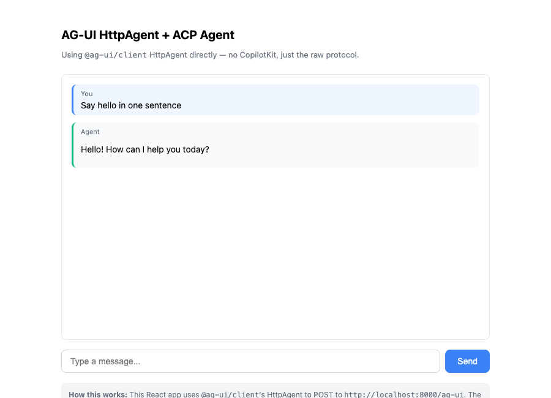
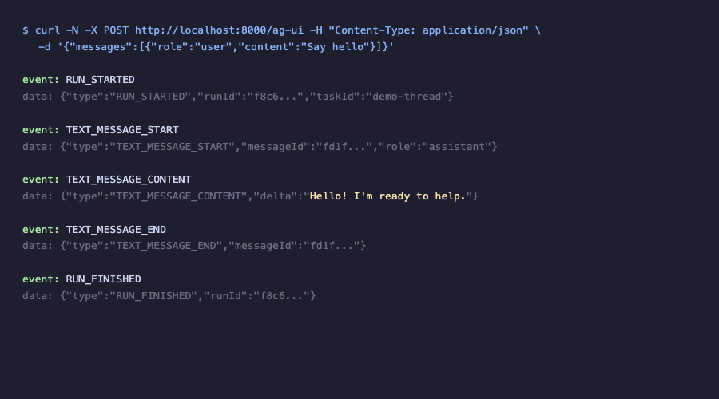
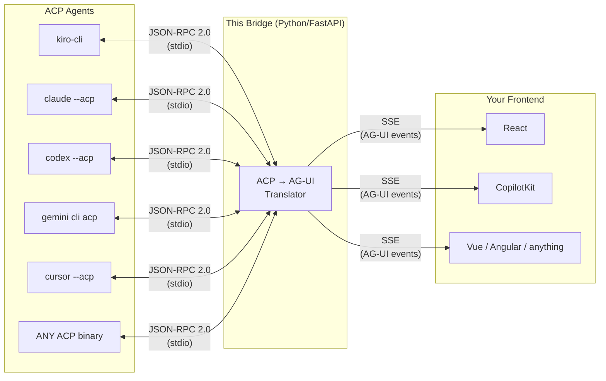

# ACP → AG-UI

> Coding agents live in terminals. This adapter gives them rich web UIs.

<p align="center">
  
</p>
<p align="center">
  <em>An ACP coding agent (kiro-cli) powering a web chat UI via AG-UI events</em>
</p>

<details>
<summary>Raw AG-UI events over SSE (what the frontend consumes)</summary>
<p align="center">
  
</p>
</details>

---

## The Problem

There are now **33+ coding agents** that support the [Agent Client Protocol (ACP)](https://agentclientprotocol.com) — Kiro, Claude Code, Codex CLI, Cursor, Gemini CLI, GitHub Copilot, OpenCode, Cline, and many more. They all speak JSON-RPC 2.0 over stdio. You can use them in terminals. You can use them in editors.

But what if you want a **custom web workspace**? A task board for your team? A domain-specific IDE? A deployment dashboard powered by an AI agent? You'd need to implement the protocol bridge yourself — parsing JSON-RPC streams, managing subprocesses, translating events into something a web frontend can render.

## The Solution

This project is a **protocol bridge** that sits between any ACP agent and any web frontend:



Clone this repo, change one line in `bridge.config.json` to point at your agent, and you have a working web UI with streaming chat, tool visualization, and human-in-the-loop approvals.

## Why AG-UI?

[AG-UI](https://docs.ag-ui.com) (Agent-User Interaction Protocol) is the open standard for connecting AI agents to frontends. Instead of rolling your own SSE/WebSocket protocol, you get:

- **~16 standard event types** — streaming chat, tool calls, state sync, generative UI, interrupts
- **Transport agnostic** — works over SSE, WebSockets, or webhooks
- **Rich ecosystem** — supported by CopilotKit, LangGraph, Google ADK, AWS Strands, Pydantic AI, and 20+ frameworks
- **Frontend SDKs** — TypeScript, Python, Kotlin, Go, Rust, and more
- **Human-in-the-loop built in** — pause, approve, reject, or redirect agent execution mid-flow

By emitting AG-UI events, your frontend becomes portable across the entire agent ecosystem. See [`docs/why-agui.md`](docs/why-agui.md) for a deep dive on what this unlocks — CopilotKit integration, shared state, generative UI, and more.

## Quick Start

```bash
git clone https://github.com/your-username/acp-to-agui.git
cd acp-to-agui
pnpm install
# Edit bridge.config.json → set "agentCommand" to your agent
pnpm dev
```

Open **http://localhost:5173**. The bridge spawns your agent, translates its output to AG-UI events, and streams them to the React frontend.

## Configuration

All configuration lives in `bridge.config.json`:

```json
{
  "projectName": "acp-to-agui",
  "displayTitle": "ACP → AG-UI Bridge",
  "agentCommand": ["kiro-cli", "acp"],
  "backendPort": 8000,
  "corsOrigins": ["http://localhost:5173"]
}
```

Just change `agentCommand` to point at your agent:

| Agent | Command |
|-------|---------|
| Kiro CLI | `["kiro-cli", "acp"]` |
| Claude Code | `["claude", "code", "--acp"]` |
| Codex CLI | `["codex", "--acp"]` |
| Gemini CLI | `["gemini", "cli", "acp"]` |
| Cursor | `["cursor", "--acp"]` |
| OpenCode | `["opencode", "acp"]` |
| GitHub Copilot | `["github-copilot-cli", "--acp"]` |
| Any ACP binary | `["your-agent", "acp"]` |

## Architecture

```
┌─────────────────────────────────────────────────────────────────────┐
│                         React Frontend (Vite)                        │
│                                                                     │
│   ChatPanel │ ApprovalDialog │ ToolCard │ SessionSidebar            │
│                                                                     │
│   useAgUiStream() hook → Zustand store → component re-renders      │
└───────────────────────────────┬─────────────────────────────────────┘
                                │ SSE (AG-UI events)
                                │ REST (task management)
                                ▼
┌─────────────────────────────────────────────────────────────────────┐
│                      Python Backend (FastAPI)                         │
│                                                                     │
│   ┌─────────────┐  ┌────────────────┐  ┌─────────────────────────┐ │
│   │ TaskManager  │  │ AcpToAguiBridge │  │ TaskStore (SQLite)      │ │
│   │ (lifecycle)  │  │ (translator)    │  │ (persistence)           │ │
│   └──────┬──────┘  └───────┬────────┘  └─────────────────────────┘ │
│          │                 │                                         │
│          ▼                 ▼                                         │
│   ┌────────────────────────────────┐   ┌─────────────────────────┐  │
│   │  AgentRunner + AcpProtocol     │   │  REST APIs              │  │
│   │  (JSON-RPC 2.0 over stdio)    │   │  /api/files, /api/git   │  │
│   └────────────┬───────────────────┘   └─────────────────────────┘  │
│                │                                                     │
└────────────────┼─────────────────────────────────────────────────────┘
                 │ stdin/stdout (ndjson)
                 ▼
        ┌─────────────────┐
        │   ACP Agent     │
        │  (subprocess)   │
        └─────────────────┘
```

## Protocol Translation

The core intellectual contribution — how ACP maps to AG-UI:

| ACP Event | AG-UI Event(s) | Notes |
|-----------|---------------|-------|
| `session/update` → `agent_message_chunk` | `TEXT_MESSAGE_START` + `TEXT_MESSAGE_CONTENT` | Opens message on first chunk |
| `session/update` → `tool_call` | `TOOL_CALL_START` + `TOOL_CALL_ARGS` | Closes any open text message first |
| `session/update` → `tool_call_update` | `TOOL_CALL_ARGS` or `TOOL_CALL_END` | Based on status field |
| `session/update` → `turn_end` | `TEXT_MESSAGE_END` + `TOOL_CALL_END`(s) + `RUN_FINISHED` | Closes everything |
| `session/request_permission` | `STATE_UPDATE` (approval pending) | ACP request/response → AG-UI state |
| Vendor extensions (`_*.dev/*`) | `CUSTOM` events | Normalized to `agent:*` namespace |

## The Tricky Parts

ACP and AG-UI do not map one-to-one. These required a normalization layer:

**Tool Approvals:** ACP uses a request/response pattern (agent sends request, client responds with approve/reject). AG-UI uses state updates. The bridge holds the RPC ID, emits a `STATE_UPDATE`, waits for the REST approval endpoint, then responds to the agent.

**Message Boundaries:** ACP streams `agent_message_chunk` continuously. AG-UI needs explicit `TEXT_MESSAGE_START` and `TEXT_MESSAGE_END` events. The bridge tracks open message state and auto-closes before tool calls or turn end.

**Vendor Extensions:** ACP agents can send custom notifications (e.g., `_kiro.dev/mcp_servers_ready`). These get normalized into `CUSTOM` AG-UI events with a clean namespace.

## How It Works

1. **You configure an agent** — set `agentCommand` in `bridge.config.json`
2. **Create a task** — `POST /v2/tasks` spawns the agent subprocess, initializes ACP
3. **Start a run** — `POST /v2/tasks/{id}/run` sends your prompt via JSON-RPC
4. **Stream events** — `GET /v2/tasks/{id}/events?runId=...` returns AG-UI SSE stream
5. **Handle approvals** — `POST /v2/tasks/{id}/approval` resolves pending tool permissions

The bridge maintains per-task state: open messages, open tool calls, pending permissions. Each task gets its own agent subprocess, event queue, and SQLite-backed metadata.

## Project Structure

```
├── backend/                    # Python FastAPI (the bridge)
│   ├── agent/                  # Agent subprocess management
│   │   ├── runner.py           # AgentRunner — spawns & communicates with ACP agent
│   │   └── acp_protocol.py    # Typed ACP interface (initialize, prompt, cancel)
│   ├── bridge/
│   │   └── acp_to_agui.py     # The star: ACP notification → AG-UI event translation
│   ├── agui/
│   │   ├── events.py          # AG-UI event type definitions (Pydantic)
│   │   └── sse.py             # SSE encoding and streaming
│   ├── tasks/
│   │   ├── manager.py         # Task lifecycle orchestration
│   │   ├── store.py           # SQLite persistence
│   │   └── routes.py          # REST API endpoints
│   ├── policy/
│   │   └── tool_policy.py     # Tool approval policy engine
│   └── api/                   # Side-channel REST (files, git)
├── reference-ui/               # React + Vite + Tailwind (reference frontend)
│   ├── components/             # Chat, Approval, ToolCard, etc.
│   ├── stores/                 # Zustand session state
│   └── src/hooks/              # useAgUiStream — SSE consumer
├── docs/
│   ├── architecture.md         # Detailed system design
│   ├── integration-contract.md # REST + SSE API spec (for UI builders)
│   └── protocol-translation.md # Full ACP ↔ AG-UI mapping
├── bridge.config.json          # Your agent configuration
└── package.json                # Workspace orchestrator
```

## For UI Builders

The backend is designed to be a **stable foundation** you don't need to modify. Build your own frontend by consuming:

- **SSE stream** at `GET /v2/tasks/{id}/events?runId=...` — AG-UI events
- **REST API** at `POST /v2/tasks`, `POST /v2/tasks/{id}/run`, `POST /v2/tasks/{id}/approval`
- **Side-channel APIs** at `/api/files` and `/api/git` for workspace operations

See [`docs/integration-contract.md`](docs/integration-contract.md) for the complete API specification.

## Supported Agents (ACP Ecosystem)

ACP is supported by 33+ agents. Any of them can be used with this bridge:

Augment Code, AutoDev, Blackbox AI, Claude Code, Cline, Codex CLI, Crow CLI, Cursor, Docker cagent, fast-agent, Factory Droid, Gemini CLI, GitHub Copilot, Goose, Hermes Agent, Junie (JetBrains), Kimi CLI, Kiro CLI, Minion Code, Mistral Vibe, OpenClaw, OpenCode, OpenHands, Pi, Poolside, Qoder CLI, Qwen Code, Stakpak, VT Code, and more.

See the full list at [agentclientprotocol.com/get-started/agents](https://agentclientprotocol.com/get-started/agents).

## The Talk

This repository accompanies the talk:

**"I Built an ACP → AG-UI Adapter So Coding Agents Can Escape the Terminal"**

Presented at [Seattle AI Tinkerers](https://seattle.aitinkerers.org/) — May 2025.

## Contributing

Contributions welcome! Areas of interest:

- Additional agent configuration examples
- Frontend components for new AG-UI event types
- Policy engine enhancements (configurable approval rules)
- Session resume/persistence improvements

## License

MIT
